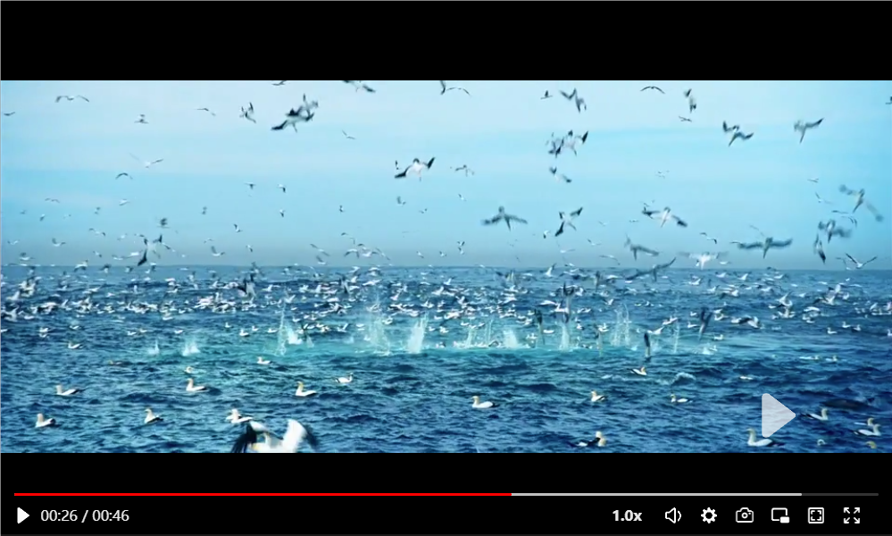

<h1 align="center">React-player-component</h1>

<p align="center">简洁，美观，功能强大的react播放器</p>

<p align="center">
  <a href="https://www.npmjs.com/package/react-player-component">
    
  </a>
  <a href="https://github.com/microsoft/TypeScript">
    
  </a>
  <a href="https://github.com/facebook/react">
    
  </a>
</p>


## ⭐说明

-   练习作品，没有经过严格测试，可能会有bug，请即使反馈
-   目前移动端只进行了简单适配，很多功能不全，后序更新会及时弥补
-   PC端的按键功能暂时缺失，后序更新会及时弥补
-   欢迎进行二次开发，同时如果你对这个项目感兴趣，对你有帮助，请点一个⭐
-   如果有什么希望增加的功能可以进行反馈

## ✨ 特性

-   📦 开箱即用的高质量 React 组件
-   🛡 使用 TypeScript 开发，提供完整的类型定义文件
-   🌍 国际化语言支持
-   🎨 主题，组件，定制能力
-   :facepunch: 强大的 API 和回调函数
-   :zap: 支持PC端和移动端（移动端进行了简要适配，功能不全）
-   :gem: 支持`HLS`（.m3u8）格式，支持`H264`格式
-   🛡 支持React`v18+`版本

## 📦 安装

#### npm

```bash
npm install react-player-component --save
```

#### yarn

```bash
yarn add react-player-component
```

## 🔨 示例

```tsx
import { ReactPlayer } from 'react-player-component';
function App() {
    return (
        <>
            <ReactPlayer
                option={{
                    videoSrc: 'https://vjs.zencdn.net/v/oceans.mp4',
                    crossOrigin: 'anonymous',
                    width: 1000,
                    height: 600,
                }}
            />
        </>
    );
}

export default App;
```

## :blue_book: ​ 文档

#### 属性/配置项

如下属性来自`option`属性配置项.

| 参数                   | 说明                                                                  | 类型                                 | 默认值      |
| ---------------------- | --------------------------------------------------------------------- | ------------------------------------ | ----------- |
| videoSrc               | 视频地址(与qualityConfig至少填写其中一个)                             | `string`                             | -           |
| qualityConfig          | 视频清晰度选择列表                                                    | `QualityConfig`                      | -           |
| height                 | 视频容器的 height                                                     | `number`                             | -           |
| width                  | 视频容器的 width                                                      | `number`                             | -           |
| style                  | 视频容器style                                                         | `CSSProperties`                      | -           |
| className              | 视频容器className                                                     | `string`                             | -           |
| crossOrigin            | 视频资源是否允许跨域（只有允许跨域才能截图）                          | `CrossOrigin`                        | -           |
| theme                  | 主题颜色                                                              | `string`                             | red         |
| poster                 | 视频封面图                                                            | `string`                             | -           |
| loop                   | 是否循环播放                                                          | `boolean`                            | false       |
| setEndContent          | 自定义视频结束时显示的内容                                            | `React.ReactNode`                    | -           |
| setBufferContent       | 自定义视频缓冲加载组件                                                | `React.ReactNode`                    | -           |
| setPauseButtonContent  | 自定义视频暂停键                                                      | `React.ReactNode`                    | -           |
| pausePlacement         | 暂停键的位置                                                          | `PausePlacement`                     | bottomRight |
| hideTime               | 多少毫秒，无任何操作，隐藏鼠标和控制器/ms                             | `number`                             | 2000        |
| isShowMultiple         | 是否显示播放倍数功能                                                  | `boolean`                            | true        |
| isShowSet              | 是否显示设置功能                                                      | `boolean`                            | true        |
| isShowScreenShot       | 是否显示截图功能                                                      | `boolean`                            | true        |
| isShowPictureInPicture | 是否显示画中画                                                        | `boolean`                            | true        |
| isShowWebFullScreen    | 是否显示网页全屏                                                      | `boolean`                            | true        |
| language               | 语言                                                                  | `zh`,`en`                            | `zh`        |
| isShowPauseButton      | 是否显示暂停键                                                        | `boolean`                            | true        |
| videoType              | 视频播放格式，支持h264(`.mp4`,`.webm`,`.ogg`)，hls(`.m3u8`)           | `h264`,`hls`                         | `h264`      |
| isShowToast            | 是否显示toast                                                         | `boolean`                            | true        |
| toastPosition          | toast的位置，此值只有`isToast`为true时，才有效果                      | `ToastPosition`                      | leftTop     |
| isShowProgressFloat    | 是否显示进度条浮层提示                                                | `boolean`                            | true        |
| progressFloatPosition  | 进度条浮层提示的位置，此值只有`isShowProgressFloat`为true时，才有效果 | `ProgressFloatPosition`              | bottom      |
| setProgressTimeTip     | 自定义时间显示                                                        | `(currentTime: string) => ReactNode` | -           |

> 温馨提示：类型接口声明如下：:point_down:
>
> ```typescript
> export type CrossOrigin = 'anonymous' | 'use-credentials' | '' | undefined;
>
> export interface QualityList {
>     key: number;
>     url: string;
>     enName: string;
>     zhName: string;
> }
> /**
>  * @description 清晰度列表设置
>  */
> export interface QualityConfig {
>     currentKey: number; // 当前清晰度
>     qualityList: QualityList[];
> }
> /**
>  * @description 暂停键位置
>  */
> export type PausePlacement = 'bottomRight' | 'center';
> /**
>  * @description 悬浮进度条位置
>  */
> export type ProgressFloatPosition = 'top' | 'bottom';
> /**
>  * @description 支持语言
>  */
> export type LanguageType = 'zh' | 'en';
> /**
>  * @description toast位置
>  */
> export type ToastPosition =
>     | 'leftTop'
>     | 'rightTop'
>     | 'leftBottom'
>     | 'rightBottom'
>     | 'center';
> ```

#### 方法

| 名称            | 说明                     | 类型                     |
| --------------- | ------------------------ | ------------------------ |
| load            | 重新加载                 | () => void               |
| pause           | 暂停                     | () => void               |
| play            | 开始播放                 | () => void               |
| setVolume       | 设置音量,[0-100]         | (par:`number` ) => void  |
| seek            | 设置指定视频的播放位置/s | (par:`number` ) => void  |
| setVideoSrc     | 设置播放视频的地址 src   | (par:`string` ) => void  |
| setPlayRate     | 设置播放倍数             | (par:`number` ) => void  |
| setMuted        | 设置静音                 | (par:`boolean` ) => void |
| changePlayState | 改变播放状态             | () => void               |

> `提示：`如上方法要使用`ref`获取才能调用
>
> ```ts
> /**
>  * @description ref 获取的react-player对象
>  */
> useImperativeHandle(ref, () => ({
>     videoElement: videoRef.current!,
>     ...videoAttributes.current,
>     ...videoMethod,
> }));
> ```

#### 回调函数

如下属性来自`callback`属性配置项.

| 名称            | 说明                   | 类型                         |
| --------------- | ---------------------- | ---------------------------- |
| onQualityChange | 视频清晰度改变回调函数 | (e: videoAttributes) => void |
| onPlay          | 视频开始播放回调       | (e: videoAttributes) => void |
| onPause         | 视频暂停播放的回调     | (e: videoAttributes) => void |
| onEnded         | 视频结束时回调         | (e: videoAttributes) => void |
| onVolumeChange  | 音量改变时的回调       | (e: videoAttributes) => void |
| onError         | 视频播放失败的回调     | () => void                   |
| onInPicture     | 进入画中画回调函数     | (e: videoAttributes) => void |
| onLeavePicture  | 离开画中画回调函数     | (e: videoAttributes) => void |
| onIsControl     | 显示控件回调函数       | (e: videoAttributes) => void |
| onRateChange    | 调整播放倍数回调函数   | (e: videoAttributes) => void |
| onWaiting       | 视频缓冲回调函数       | (e: videoAttributes) => void |

#### 视频属性

```typescript
/**
 * @description 视频播放属性
 */
export interface VideoAttributes {
    /**
     * @description 是否播放
     */
    isPlay: boolean;
    /**
     * @description 当前时间/s
     */
    currentTime: number;
    /**
     * @description 持续时间
     */
    duration: number;
    /**
     * @description 缓冲时间
     */
    bufferedTime: number;
    /**
     * @description 是否开启画中画
     */
    isPictureInPicture: boolean;
    /**
     * @description 音量
     */
    volume: number;
    /**
     * @description 是否静音
     */
    isMute: boolean;
    /**
     * @description 视频播放倍数
     */
    multiple: number;
    /**
     * @description 是否播放结束
     */
    isEnded: boolean;
    /**
     * @description 错误
     */
    error: string | undefined;
    /**
     * @description 暂停缓冲
     */
    isWaiting: boolean;
}
```

#### `react-video-player`接收的参数接口如下：:point_down:

```tsx
export interface VideoProps {
    option: VideoPlayerOptions;
    callback?: Partial<VideoCallBack>;
}
```

#### **后序更新计划**

-   更新PC端的按键快进、后退、暂停、播放等功能
-   更新全新的移动端逻辑、包括左边上划亮度提升、右边上划音量提升、右划快进、左划后退等逻辑
